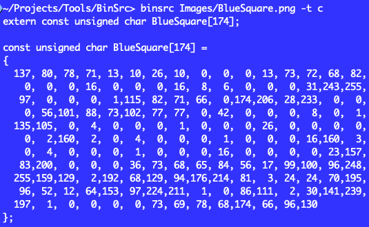
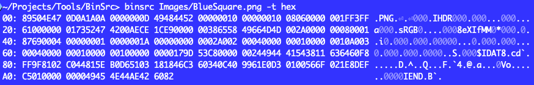
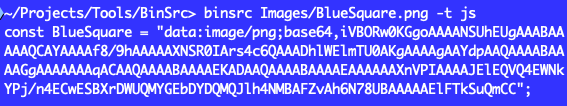
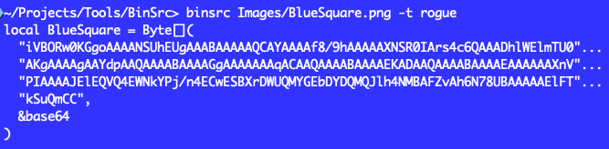

# BinSrc
Converts the bytes of a binary file into source code (C/C++, JavaScript, Rogue) or an ASCII hex dump.

About     | Current Release
----------|-----------------------
Version   | 1.0
Date      | April 6, 2024
Platforms | Windows, macOS, Linux
Author    | Brom Bresenham

# Installation
1. Install [morlock.sh](https://morlock.sh)
2. `morlock install brombres/binsrc`

# Usage

    USAGE
      binsrc [OPTIONS] filename ...

    OPTIONS
      --help, -h, -?
        Show this help text.

      --target=<target>, -t <target>
        Print source code for the specified target language:
          [c|cpp|c++] (default) - C/C++/C-like
          hex                   - Hex columns
          [js|javascript]       - JavaScript
          [rogue|boss]          - Rogue/Boss

# Examples

## Test Image

BlueSquare.png

## C Target
    binsrc Images/BlueSquare.png -t c

## Hex Target
    binsrc Images/BlueSquare.png -t hex

## JavaScript Target
    binsrc Images/BlueSquare.png -t js

## Rogue Target
    binsrc Images/BlueSquare.png -t rogue

